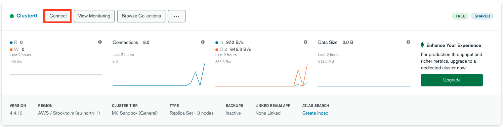
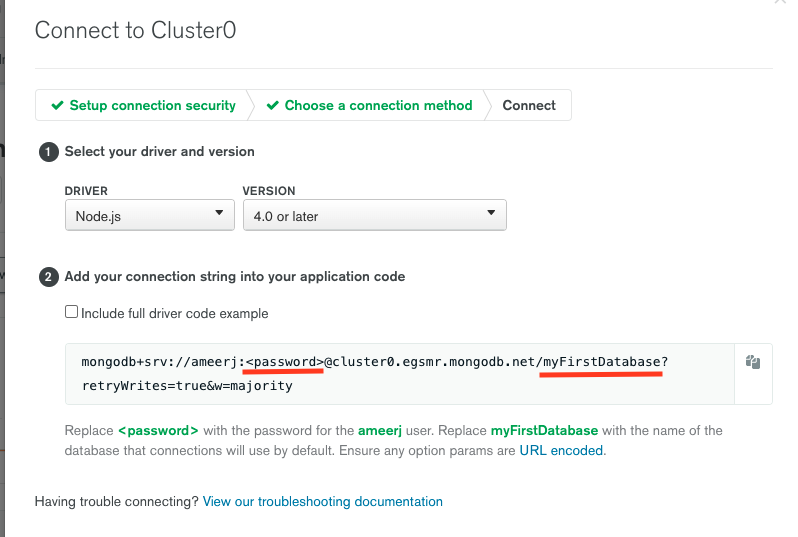
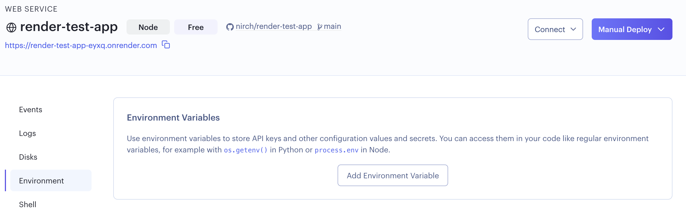
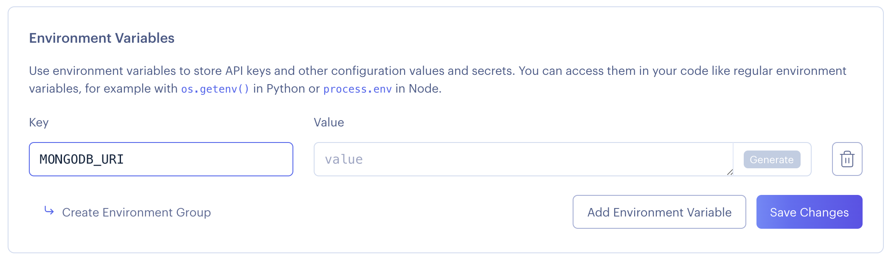

# Atlas & Connecting the App

Now it's time to connect to our App

Lets go back to the Database page, This time we will click on Connect
  


Click on ```Connect your Application``` Button.

---

You will be provided with what Driver you need and the connection string



**Notice!** you will need to replace the following:
- ```<password>``` -> your actual password 
- ```myFirstDataBase?``` -> your database name

---

In Render, head to the 'Environment' tab and click on the 'Add Environment Variable' button:


  

Here you need to add a MONGODB_URI key, and paste the connection string you've been given before:


  

That's all for the Mongo setup - one last step and you're ready to deploy again!
