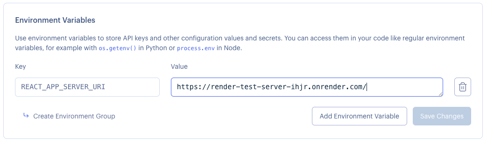
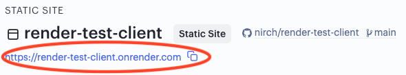

# Deploying React to Render

Deploying your React application to Render is even easier!

## STEP 1: Prerequisites
In a local development environment when you are making AJAX calls from your React client to your server, your are most likely using `localhost` for making these calls. Your axios setup probably looks something similar to this:

``` javascript
const server = axios.create({
  baseURL: 'http://localhost:3000'
});
```

When you deploy this React application to the cloud calling `localhost` will obviously not work.

Instead, you should use an environment variable for your server URI. Any custom environment variable you create in a React application must start with a REACT_APP_ prefix. You can read more on environment variables in React [here](https://create-react-app.dev/docs/adding-custom-environment-variables/). 

Hence, you should change your axios setup to use the environment variable if exists, otherwise continue using the localhost. The code could look similar to this: 

``` javascript
const server = axios.create({
  baseURL: process.env.REACT_APP_SERVER_URI
    ? process.env.REACT_APP_SERVER_URI
    : 'http://localhost:3000',
});
```

## STEP 2: Deploy React Application to Render
Now, we are ready to deploy our React application to Render. Follow the simple steps [here](https://render.com/docs/deploy-create-react-app).

Some things to note:
1. Make sure you follow the *Using Client-Side Routing* chapter if you have routes in your react app.
1. Make sure you add and environment variable for the server URL as described above in the prerequisites is needed. Use the URL that you got from Render when you deployed your server side.



## STEP 3: Access your App from the Cloud

Once your app is deployed you can access it via the auto-generated URL you can find in the upper left corner.


