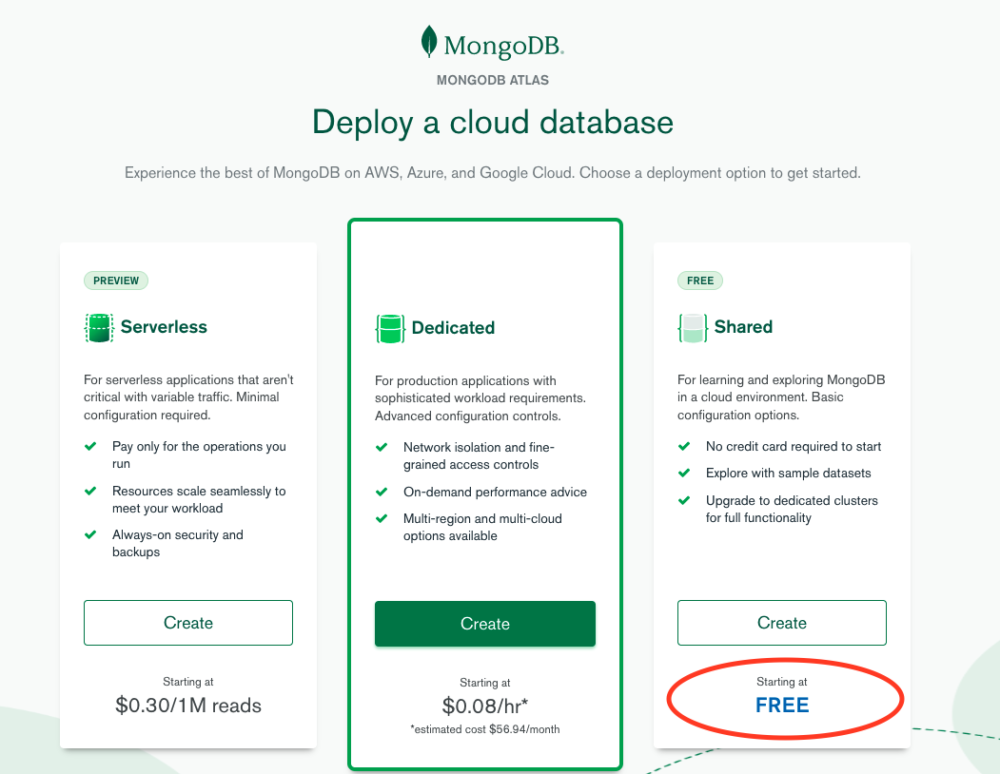
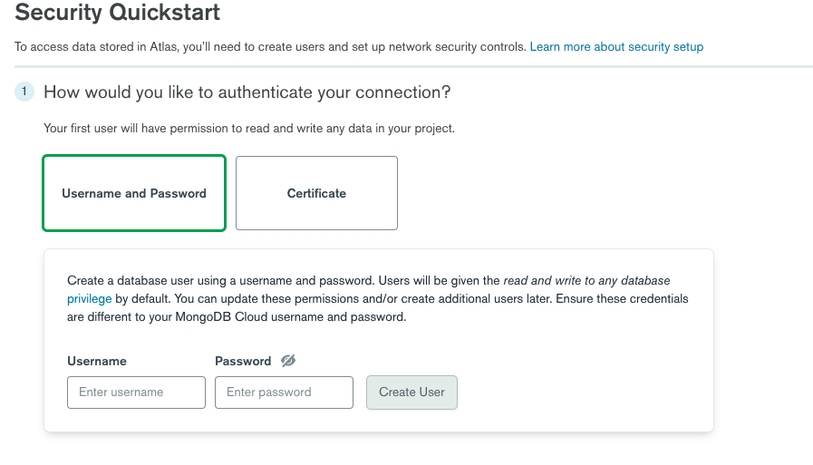
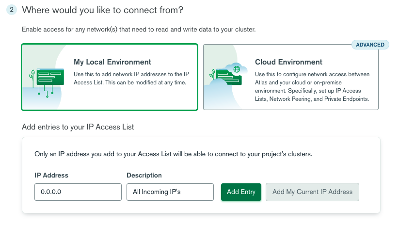
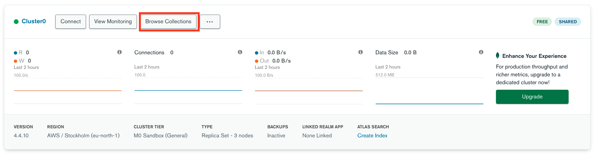
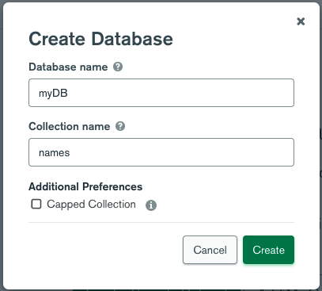

# MongoDB Setup & Atlas

You know how sometimes you start your app, complain that it doesn't work, call for help and spend 30 minutes debugging just to find out that your `mongod` wasn't running in the background? Well, that's happening now - you don't have a MongoDB server connected to your app!

  

To fix this, we'll use [MongoDB Atlas](https://www.mongodb.com/cloud/atlas/lp/try2?utm_source=google&utm_campaign=gs_emea_israel_search_brand_atlas_desktop&utm_term=atlas%20mongo&utm_medium=cpc_paid_search&utm_ad=e&gclid=CjwKCAjwmf_4BRABEiwAGhDfSUwMwxfMND4AsTLi1XU46DexDbUvbmyIZ8UqRJcSheizGHhw7unndRoCwo0QAvD_BwE) - a cloud-hosted MongoDB service on AWS, Azure and Google Cloud (in their own words). Or in our words, a powerful tool that'll take our database from our personal computer out and into the web.

  

Go ahead and open a free account.

  

Once you have an account and are logged in - create a cluster (click on the 'Build a Cluster' button):

  



You can choose the Starter Cluster, which is free of charge. This can take a couple of minutes.

Afterwards, follow the instructions - you'll be asked to:

1.  Select a preferred Cloud Provider & Region (at this point it's not so important which one you'll choose)
2.  Select MO Sandbox (again, select the 'free forever' one)
3.  you do not need to touch the additional settings
4.  Enter a name for your cluster and click on _Create Cluster_

---

Now it will bring you to the **Security Quick Start**



In here you will need to enter a username and password (you will need it later on to connect to ur DB)

---

For the sake of setting up Atlas with Render , you will need to whitelist All incoming IP's to your DB

so enter 0.0.0.0 (Accessed from any IP)



---

Then you will be asked to move to your database 
you might have to wait a few minutes for the cluster to be created. once its done click on the ```Browse Collection``` Button



In here we need to create a Database, Click on ``` Add my own Data``` Button , you can call it any name and give it an initial collection


(this is just an example)

Now you have created a Database on your Atlas, lets move to how you connect it to your project.
