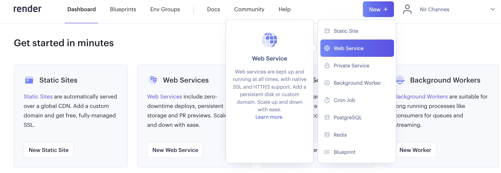
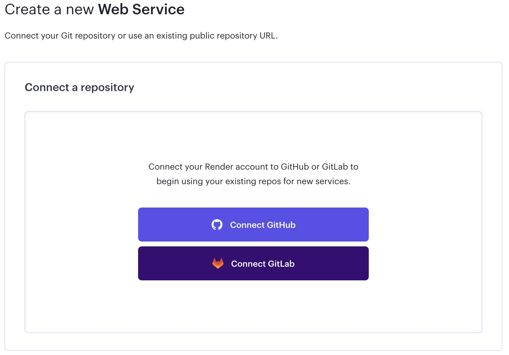
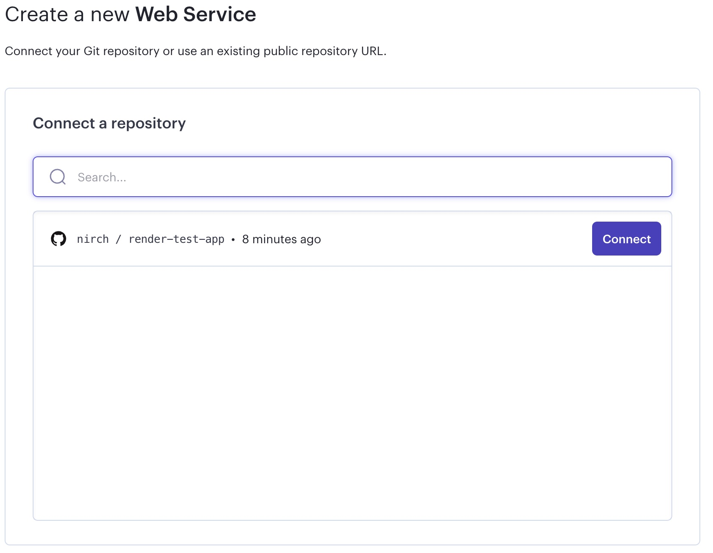
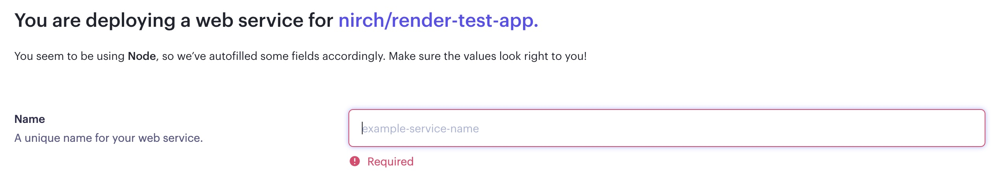
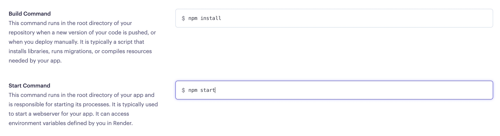
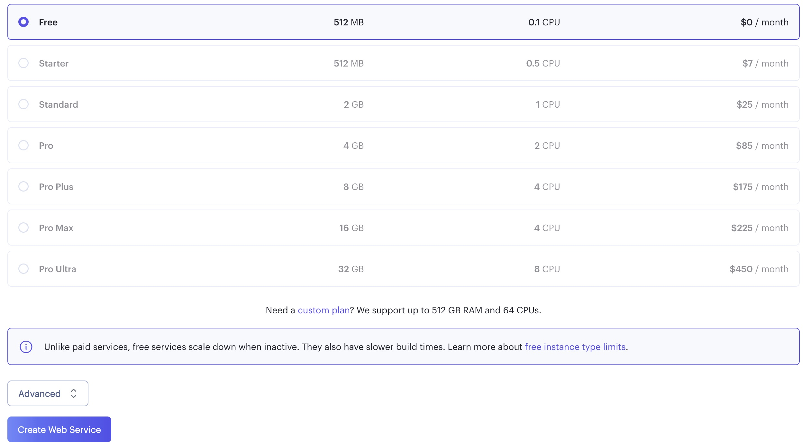
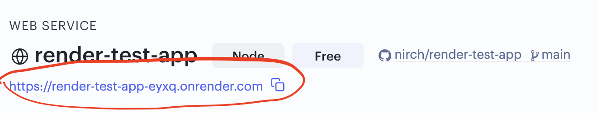
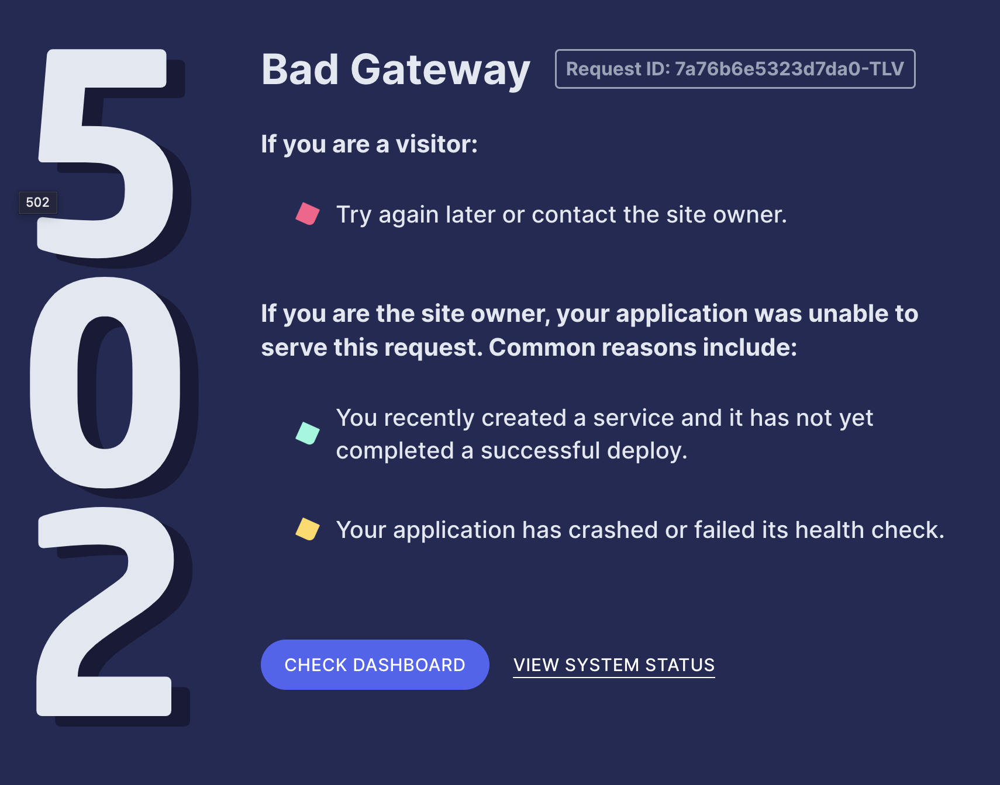
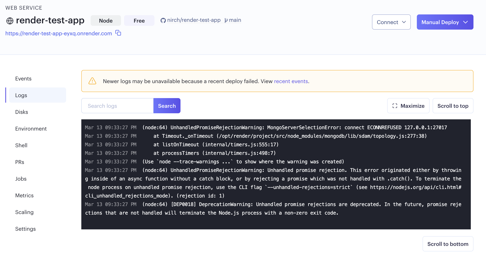

# Setup

## STEP 1: Render Account

Today we will be deploying a project of your choice (**Important:** make sure that whatever project you are deploying to Render has a Git repository). First, we'll need a Render account. To get that, [click here and sign-up](https://dashboard.render.com/register).

----------

  

## STEP 2: Create an App (aka Web Service)

  
After you've signed up, click the "New" button in the top-right corner, click "Web Service"

----------

## STEP 3: Connect Your GitHub Repository

**Connect to GitHub**

The first time you are using Render you need to connect (and authorize) your GitHub account. You can decide if you want to give Render access to all your repositories or selected ones only. 

Click "Connect" on the repository you want to deploy and run in the cloud.

----------

  

## STEP 4: Configure Your App

First, give your app a name.

Then, enter the build and the start commands for your app. Usually the build command will be `npm install` and the run command will be `npm start`.

Finally, make sure you select the free instance type and click "Create Web Service".

----------

## STEP 5: The Deploy

Now sit back and relax - your app is being deployed to the cloud!

Once your app is deployed you can access it via the auto-generated URL you can find in the upper left corner.

  
----------

## STEP 6: Troubleshooting
  
Life is not always smooth... Every once in a while instead of seeing your amazing app you will see something like this:

  

**The most common way to solve most of Render issues is checking the** _log_.

It contains any error just like the ones we see when we develop our servers. Don't forget to check it!

  