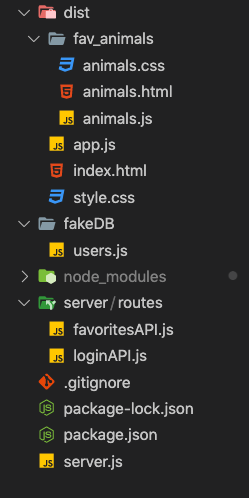

# JWT in NodeJS server

## File Structure
We will be exploring the following example of a server, please clone the [following project](https://github.com/Elevationacademy/jwt-spotcheck-ex).

## Overview

This project is a simple App that returns the users favorite animal, This App contains a login page as well. we will be implementing the authentication in this project.

don't forget to install the node modules.

```bash
$ npm install
```

Let's explore our server and how it's built.



## The folder structure

- **Dist folder :** this folder contains everything that is served to the client that connects to the server.
  - **Fav Animals folder :** this folder contains a page that displays a button which gets the users favorite animal.
  - **index.html :** this file is a `login` page that should redirects to `animals` page if successfully logged
---
- **Server folder :** a folder that contains folders and files relevant to the server.
  - **Routes folder :** a folder that contains all the different **API** routes.
    - **loginAPI file :** a file that contains functionality and routes related to login.
    - **favoritesAPI file :** a file that contains functionality and routes related to a users favorite animals.
- **FakeDB :** a folder that contains a file in which there are the users (this in reality should belong in a database)
---
- **Server.js file :** a file that contains the server.

This an **overall summary** of the project.
let's dive deeply into each part.
