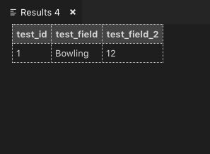
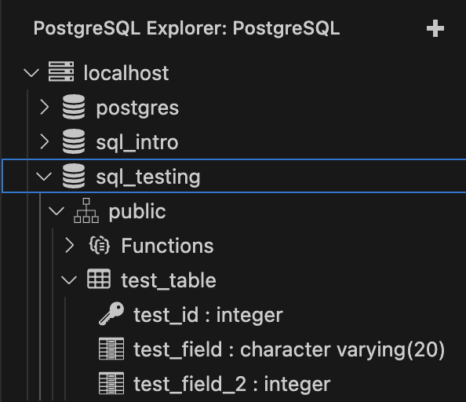

# First Table Validation

To make sure you're all set, **right click the** **`sql_testing`** **connection and press** **`New Query`**

  

A new file should have opened up. Go ahead and copy paste the following SQL commands- don't worry, we'll explain everything soon. This is just for testing:

```sql
-- Make sure you're connected to the sql_testing database

CREATE TABLE test_table(
    test_id SERIAL PRIMARY KEY,
    test_field VARCHAR(20),
    test_field_2 INT
);

INSERT INTO test_table(test_field, test_field_2) VALUES('Bowling', 12);
SELECT * FROM test_table;
```
  

Run this code by using the **Run Query** button or the keyboard shortcut provided by your PostgreSQL extension.

  

If all is truly well, you should see this screen pop up on the right of your VS Code:

  



  

And you should be able to **refresh** the `localhost` connection and see the following under the **PostgreSQL** tab:

  



  

----------

  

  

#### **DONE;**

  

Great, now you're ready to learn SQL.
