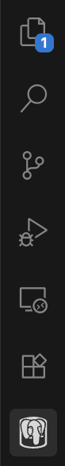
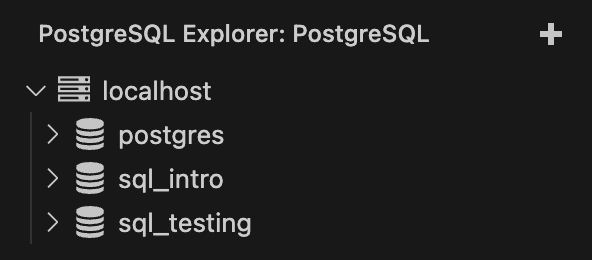

# VS Code Setup

Start by installing [this extension](https://marketplace.visualstudio.com/items?itemName=ckolkman.vscode-postgres).\
_If you are using Open VSX for the extensions then use [this](https://open-vsx.org/extension/ckolkman/vscode-postgres) link instead_

  

Once it's installed and you've restarted/reset your VS Code, you should see a PostgreSQL Explorer icon in your sidebar.

  

  

If you press that you'll see a plus (+) sign appear - press that and at the top of your editor you'll be prompted for some info to connect to the server we created earlier.

  

To connect to the server, go ahead and **use the following connection parameters**:

-   **hostname:** `localhost`
-   **user:** `postgres`
-   **password:** (nothing - just press enter, unless you set a password during the PostgreSQL setup)
-   **port:** 5432 (should be the default)

  

The `localhost` server should pop up under the PostgreSQL section, and if you open it, it should look something like this:

  

  
