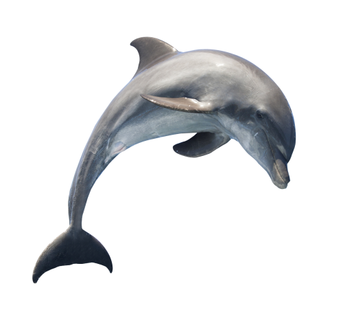

# Exercises

## Exercise 1

Ok - that was a shallow intro to SQL - and now it's your turn.
    
For these exercises, start by doing the following:
    
-   Create a new table - "Dolphin" with the following columns:
    -   `name` - should be the `PK`
    -   `color`
    -   `height` - should be a small number
    -   `healthy` - this is a boolean value. Use SQL's `BIT` type and **give them a value of** **`true`**  [**by default**](https://dev.mysql.com/doc/refman/8.0/en/data-type-defaults.html)
-   Add a few dolphins to your table
    -   One should be named "Daron"
    -   At least one should have a height less than 2
    -   At least one should be blue _and_ have a height less than 2
    -   At least one should have a height greater than 2
    -   At least one should be green
-   Try adding a dolphin without a name. What is the error?
    
----
    
Find all dolphins with a height greater than 2.
    
    
## Exercise 2

Find all dolphins with a `name` that has the letters "_on_" anywhere in the name.

## Exercise 3

Delete all the dolphins that are shorter than 2 meters AND are blue - they're worthless.

** Remember to comment out any other code that isn't related to the above query (such as `SELECT`) for the purpose of passing our tests
    

    
## Exercise 4

Update the dolphin whose `name` is "Daron" to have a `height` of 6.
    
      
** Remember to comment out any other code that isn't related to the above query (such as `SELECT`) for the purpose of passing our tests
    

## Exercise 5
    
For all the dolphins with a green OR brown `color`, change their `healthy` value to `false`.
    
** Remember to comment out any other code that isn't related to the above query (such as `SELECT`) for the purpose of passing our tests
    

## Exercise 6
    
Retrieve only the `name` and `height` for all the _healthy_ dolphins sorted by their height (tallest to shortest).
    
      
    
----------
    

**DONE**
    
      
    
That's all for now.
    
> So long, and thanks for all the fish!
    

