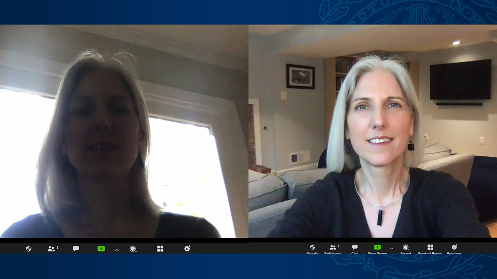
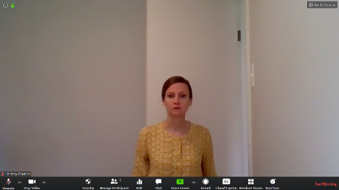

# Zooooooom
Since we are going to be using zoom our trainings, we’ve created some guidelines for you.

## Installing Zoom
In the rare case you don't already have zoom installed - here is the [link](https://zoom.us/download).

## Camera Setup
It is very important for us to be able to see you and interact with you. 

It is **Mandatory** to keep your camera open, unless there is a special situation and should be notified to the Bootcamp Staff.

Let’s look at this picture:

Notice that the Women on the **Left** is in a dark setting and we cannot see her face. So make sure you are sitting next to a light source or facing a window.

we want to have our face clearly shown. not too far away and not too close. like the women on the **Right**

Here is another example of how your camera should not be:

The women is sitting too far away and we cannot see her face clearly.

So please make sure before you join the ZOOM call:
- The lighting is correct and we can clearly see your face
- The internet connection is working well and you are not lagging
- Your camera is placed in a correct position where we see your face
facing frontwards

## Tutorial
This short tutorial show a couple of important feature in zoom - especially the "raise your hand" feature which we encourge on using. Please note that the trainer might not get to you right away as s/he is wrapping up an important point - but don’t worry, your questions are important to us =]

<iframe width="560" height="500" src="https://www.youtube.com/embed/KtF0hvoWJS4?si=KY_Hx8GVLK7PduGo" title="YouTube video player" frameborder="0" allow="accelerometer; autoplay; clipboard-write; encrypted-media; gyroscope; picture-in-picture; web-share" referrerpolicy="strict-origin-when-cross-origin" allowfullscreen></iframe>