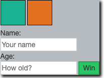

    
Time to get in touch with your inner child and get to the drawing board. Given the following, plain, boring, lifeless HTML:
    
      
```html
    <div id="container">
      <span class="box" id="first"></span>
      <span class="box" id="second"></span>
      <div class="prompt">Name:</div>
      <input type="text" placeholder="Your name">
      <div class="prompt">Age:</div>
      <input type="number" placeholder="How old?">
      <button class="button">Win</button>
    </div>
```
  

Add some CSS to create this masterpiece:




    
   **Hint:** The following properties should be enough:
    
      
    
   -   background-color
    -   border
    -   display
    -   width
    -   height
    -   box-shadow
    
      
    
   **Hint 2:** Don't forget about **block** vs. **inline** elements.
    
      
    
   ----------
    
      
    
   #### **DONE.**
    
   Alright, so this was intense, but covers the main principals in CSS!
    
   If you want further, more in-depth, reading then maybe try this [resource](https://developer.mozilla.org/en-US/docs/Learn/CSS/Introduction_to_CSS/Cascade_and_inheritance).

