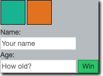
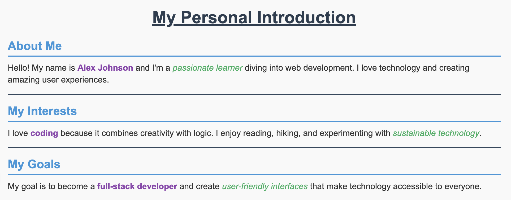
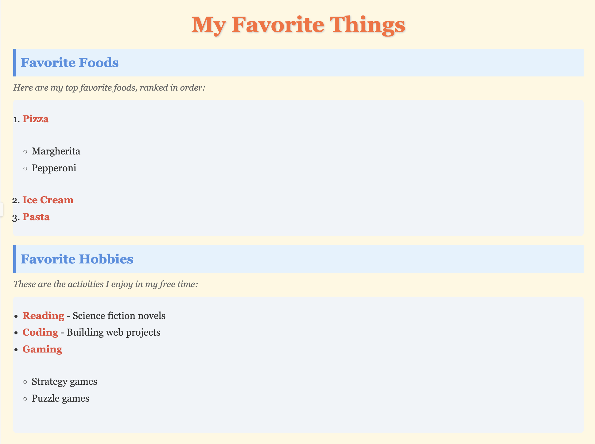
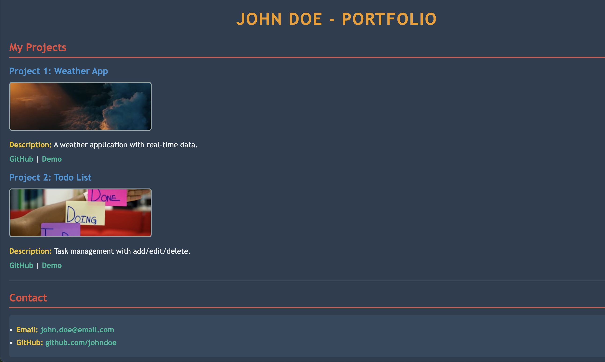
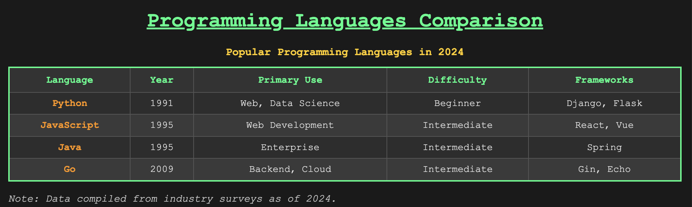
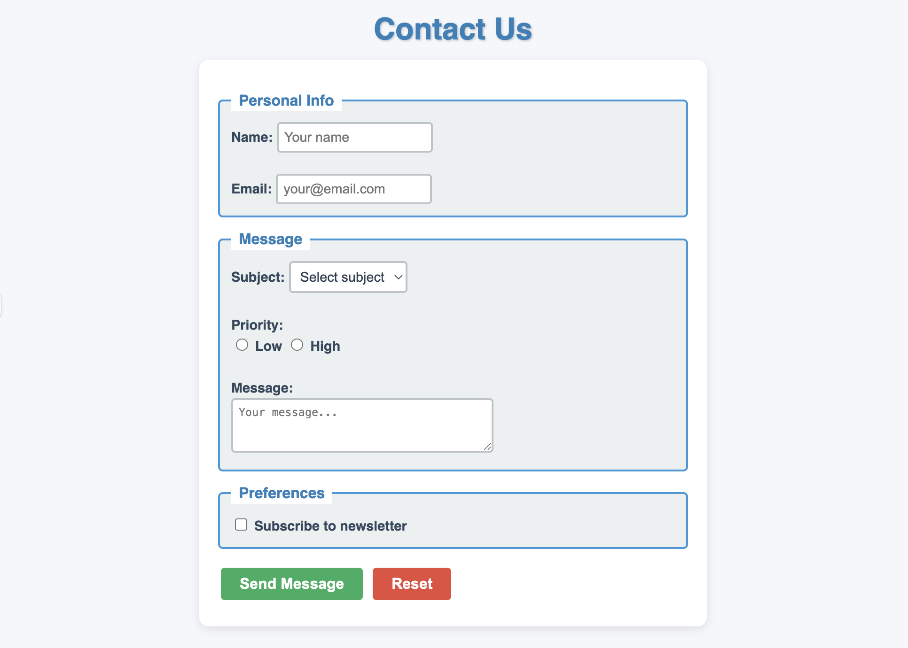

# Excercises

## Excersie 1
Create a webpage with 3 lines of text, each with a different size, color and font.

#### Example


## Excersie 2
Create a webpage with links to important websites, so that every bookmark would lead to a different page.\
Make sure they open in different tabs. For example:
- News - ynet.co.il
- Youtube - youtube.com
- Facebook – Facebook.com

Make sure to design it in a nice looking manner. The entire box should be clickable.

#### Example


## Excersie 3
Replace the buttons with images. Make sure clicking on the image opens the link in a new tab.

#### Example


## Excersie 4

Time to get in touch with your inner child and get to the drawing board. Given the following, plain, boring, lifeless HTML:
      
```html
    <div id="container">
      <span class="box" id="first"></span>
      <span class="box" id="second"></span>
      <div class="prompt">Name:</div>
      <input type="text" placeholder="Your name">
      <div class="prompt">Age:</div>
      <input type="number" placeholder="How old?">
      <button class="button">Win</button>
    </div>
```
  

Add some CSS to create this masterpiece:




    
**Hint:** The following properties should be enough:
-   background-color
-   border
-   display
-   width
-   height
-   box-shadow

**Hint 2:** Don't forget about **block** vs. **inline** elements.
    


## Excersie 5
Create a webpage with a table that displays the standing of football teams in the Israeli premier league.

#### Example


## Excersie 6
Create a webpage with a recipe for your favorite dish. Make sure to use at least one image, a list and a link.

#### Example


## Excersie 7
Create a page with an image on the body. 
Add 2 titles:
1. transparent title. Note that the text and the element itself should be transparent.
2. Another title, that should not show any of the image underneath it.


## Excersie 8
Add style to all your HTML exercises from the previuos chapter. Following see examples of where you should aim to. It is a good idea to try and make it as similar as possible. Gain progress here as time permits, the more you practice the better CSS developer you become :)

#### Example - Ex1 Personal Introduction

#### Example - Ex2 Favorite Things

#### Example - Ex3 Personal Portfolio

#### Example - Ex4 Table

#### Example - Ex5 Contact Form


    
----------  

#### **DONE.**

Alright, so this was intense, but covers the main principals in CSS!

If you want further, more in-depth, reading then maybe try this [resource](https://developer.mozilla.org/en-US/docs/Learn/CSS/Introduction_to_CSS/Cascade_and_inheritance).

