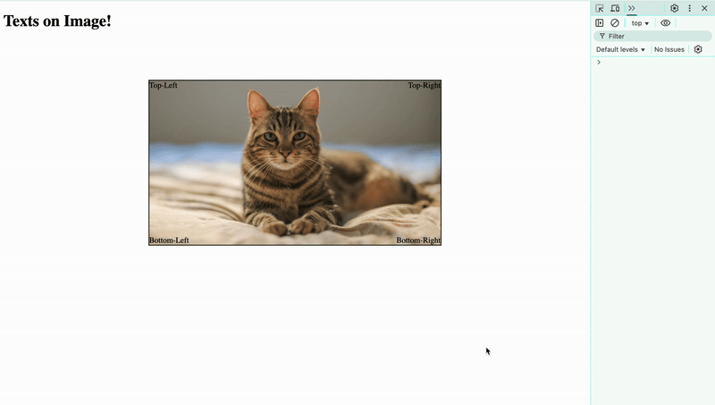
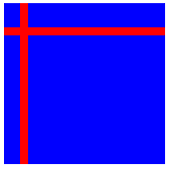
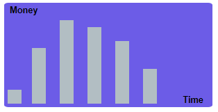

# Exercises

## Exercise 1
Place texts on the 4 corners of an image.

- Make the image responsive (place the image inside a container)
- Center the image (using `margin: auto;`)
- The texts should stay in the corner when the image is resized



## Exercise 2
Create the following:



<details>

<summary>  
Click here to get a hint on the HTML structure (try without it first)
</summary>

```html
<div id="parent">
  <div class="child" id="child-1"></div>
  <div class="child" id="child-2"></div>
</div>
```

</details>


## Exercise 3
Create the following:



<details>

<summary>  
Click here to get a hint on the HTML structure (try without it first)
</summary>

```html
<div class="background">
  <div class="text" id="money">Money</div>
  <div class="text" id="time">Time</div>
  <div class="bar" id="bar-1"></div>
  <div class="bar" id="bar-2"></div>
  <div class="bar" id="bar-3"></div>
  <div class="bar" id="bar-4"></div>
  <div class="bar" id="bar-5"></div>
  <div class="bar" id="bar-6"></div>
</div>
```

</details>


## Exercise 4
Create the following:


For this one, the `border-radius` property will help you.\
Also, the `border-top-left-radius` property - and other similar ones which you can guess ;)

<details>

<summary>  
Click here to get a hint on the HTML structure (try without it first)
</summary>

```html
<div class="red-background">
  <div class="silver-edges" id="edge-1"></div>
  <div class="silver-edges" id="edge-2"></div>
  <div class="white-space"></div>
</div>
```

</details>
