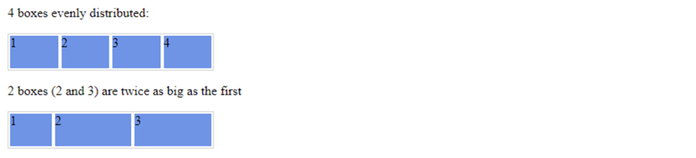

# Flexbox Exercises

A hint for the exercises: many times the solution for layouting is **nesting flex containers**.

## Exercise 1
Practice flexbox basics in a fun way by completing all levels of [Flexbox Froggy](https://flexboxfroggy.com/).

## Exercise 2
Create 2 boxes distributions:
1. 4 boxes evenly distributed
1. 2 boxes (2 and 3) are twice as big as the first

_use flex-grow to achieve both_

## Exercise 3
Create the following using flexbox:

## Exercise 4
Create the following using flexbox:

## Exercise 5
Create the following using flexbox:

## Exercise 6
Create the following using flexbox:

