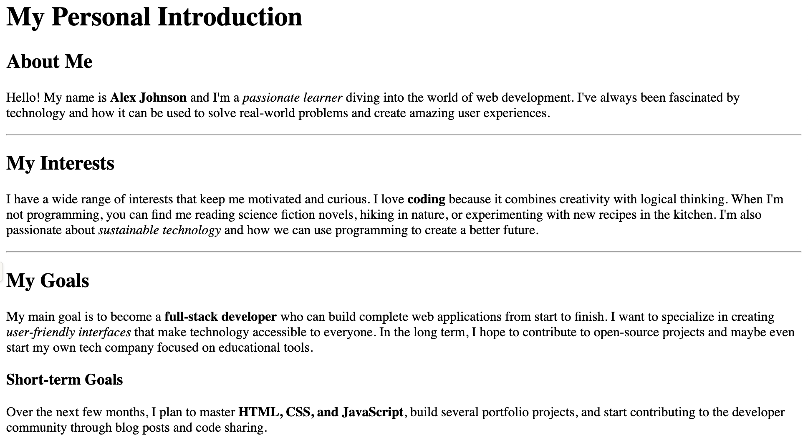
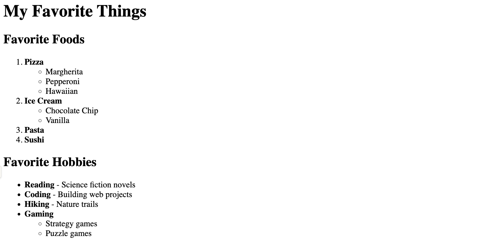
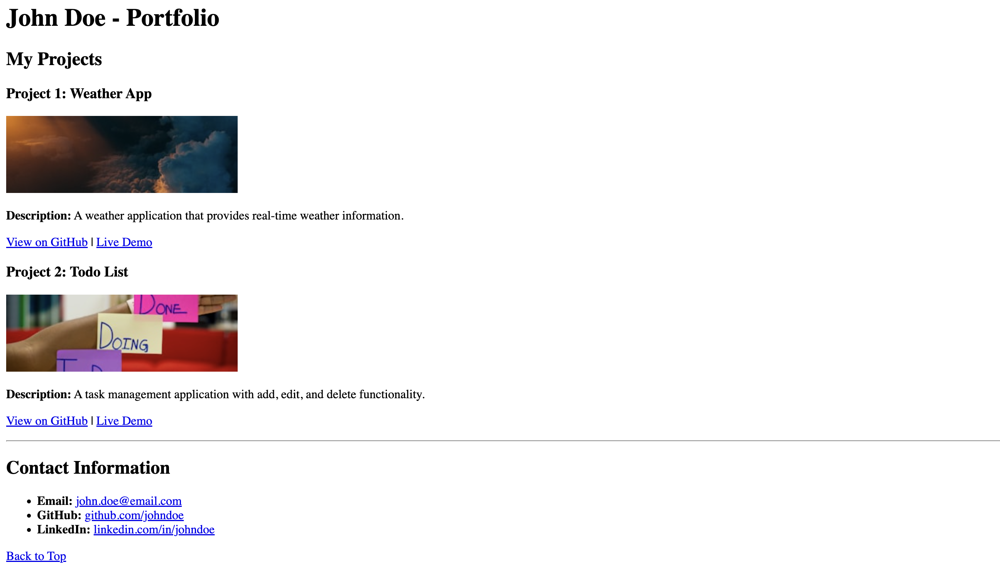
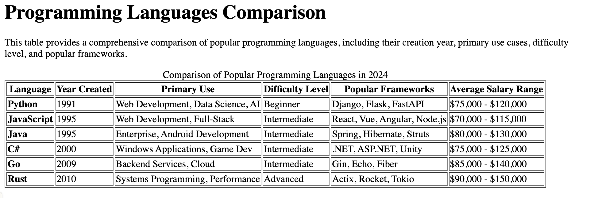
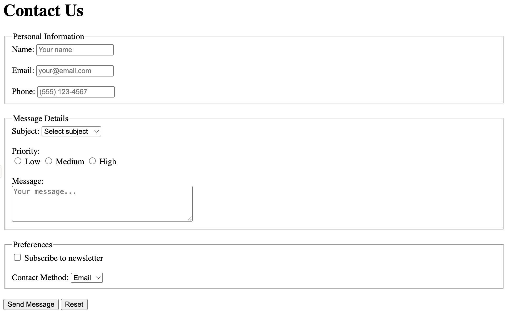

# Now You!

You've got a bunch of elements. It's your time to learn through experimentation. Remember, no CSS here. And add real information about yourself so we will get to know you :)

##  Exercise 1
Create a simple personal introduction page using basic HTML elements.

##### Requirements
- Include a title in the head section
- Use heading tags (h1, h2, h3)
- Include at least 3 paragraphs about yourself
- Add a horizontal rule to separate sections
- Use emphasis tags (strong, em) to highlight important information

##### Example Output

## Exercise 2
Practice creating ordered and unordered lists with nested elements.
##### Requirements
- Create a page about your favorite things
- Use both ordered (ol) and unordered (ul) lists
- Include at least one nested list
- Add a main heading and subheadings
- Include brief descriptions for each category

##### Example Output

## Exercise 3
Create a basic portfolio page with links and images.

##### Requirements
- Create a portfolio page with sections for projects
- Include at least 3 external links (use target="_blank")
- Add at least 2 images with alt text
- Include an email link (mailto:)
- Add a "Back to Top" internal link

##### Example Output

## Exercise 4
Create a structured table with proper formatting.

##### Requirements
- Create a table with at least 4 columns and 5 rows
- Include table headers
- Use table caption
- Include a summary or description of the table data

##### Example Output

## Exercise 5
Create a comprehensive contact form using various input types.

##### Requirements
- Create a contact form with multiple input types
- Include proper labels for all form elements
- Use fieldsets to group related form elements
- Include various input types (text, email, tel, textarea, select, radio, checkbox)
- Add a submit and reset button
- Include placeholder text and required attributes

##### Example Output

