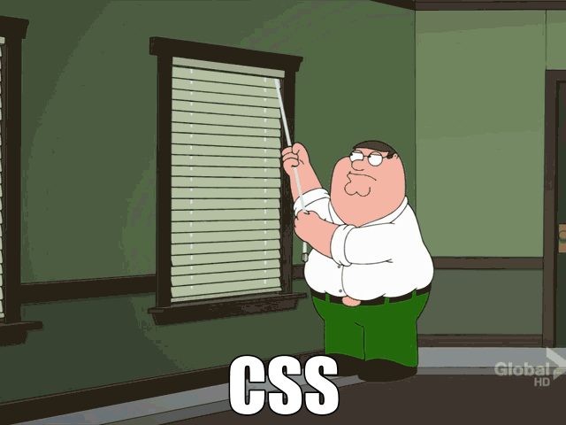
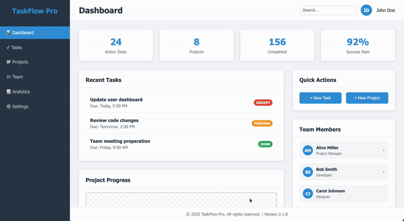

# CSS Debugging Project

In this project you will expirence how it feels like to debug CSS. 

🚨 **Spoiler Alert** 🚨\
It doesn't feel that good.\
Until... you find the bugs and start feeling that you understand CSS and transform into a "bring it on" mood 🦍

## Fixed Version
This is the design you need to achieve. You have it here both as an image (2 images, since scrolling is needed) and also as a gif showing it live in the browser with scrolling and hover effects.

[Fixed Version Top](/intro-web-dev/project-css-debug/img/fixed-version-top.png ':ignore :target=_blank')\
[Fixed Version Bottom](/intro-web-dev/project-css-debug/img/fixed-version-bottom.png ':ignore :target=_blank')

## Starting Point
Download the starting point project from [here]().

## Guidlines

- Try to get as close to the "fixed version" as possible
- Work with the browser developer tools. Trail and error and fix things first there and then in the code
- There are about ±20 fixes needed in the CSS
- One fix is also needed in the HTML structure (maybe it is also possible without it, but better with it)
- Try making commits for each fix/bug you find

Good Luck! 😎