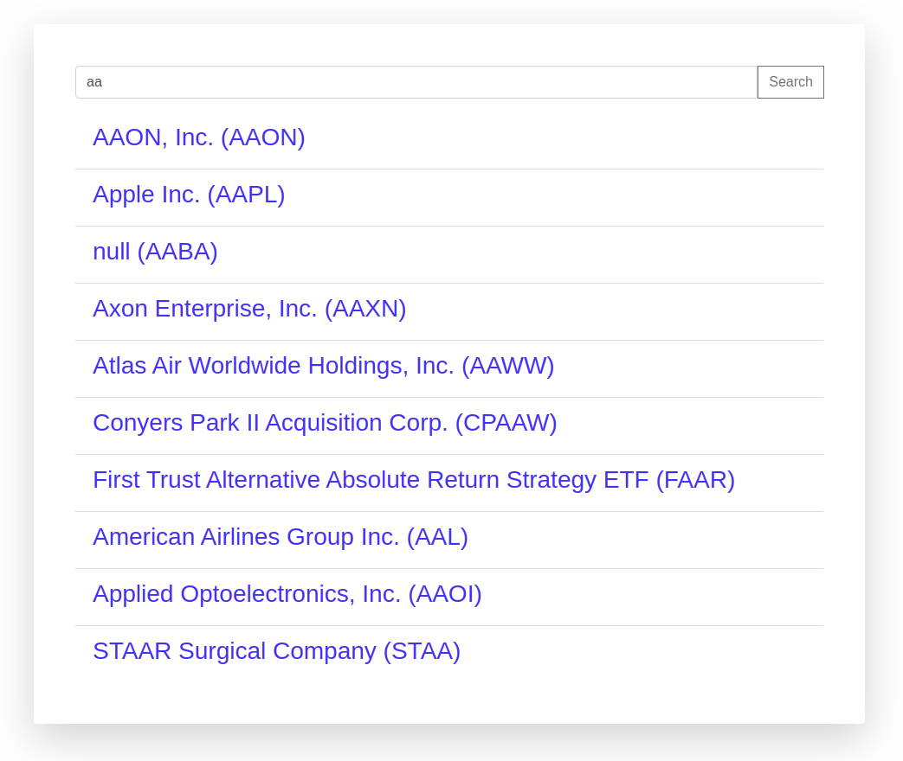
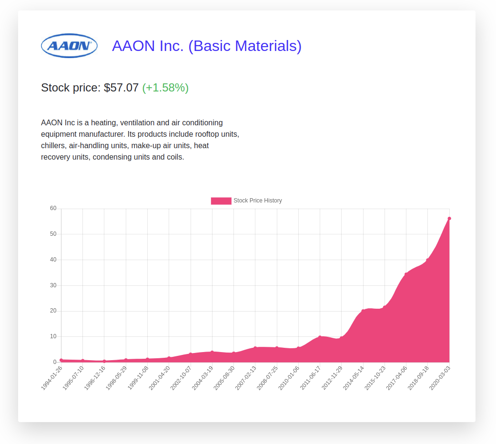
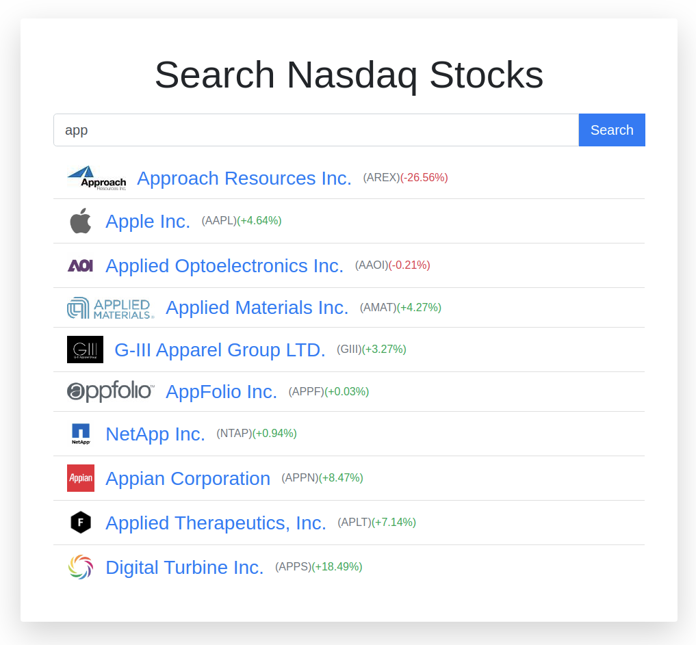
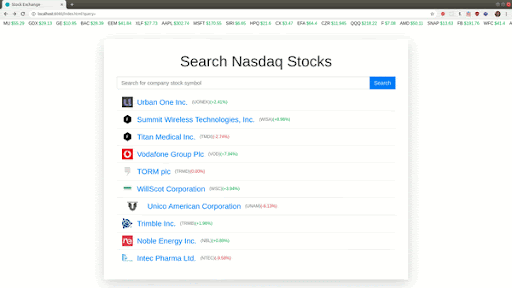
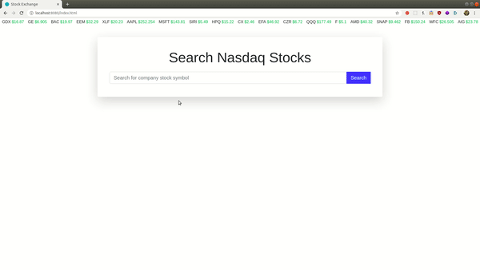
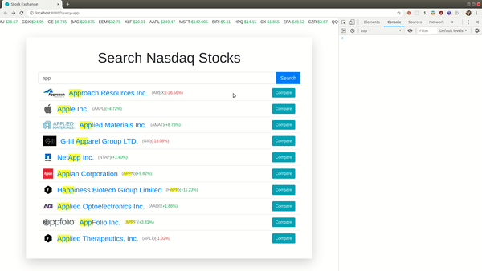
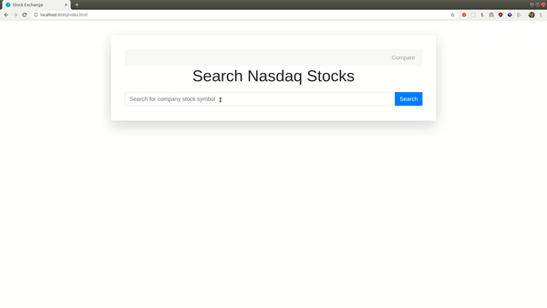
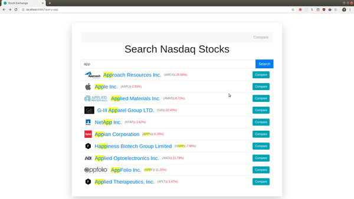

# Stock Exchange

---

## Summary

In this project you will build a multipage stock exchange data website.

This project is based on [Financial Modeling Prep - FinancialModelingPrep](https://financialmodelingprep.com/), you can find all of the API endpoints here: [Free Stock API and Financial Statements API - FMP API](https://financialmodelingprep.com/developer/docs/).

We do not provide a design, instead we add a screenshot for inspiration. We encourage you to make your own amazing design. Feel free to use vanilla CSS or any CSS library (tailwind, bootstrap, etc.).
 
Steps that have a decimal number are optional - do them only if you feel you have enough time. You can skip them, and return to them when you finish the mandatory Steps.

## Reporting progress

After completing a Step, push a commit indicating you completed the Step (e.g. "Step 3 done"), and make sure it is in the main/master branch.

## !!Notice!! 

- The API has a limit of 250 calls a day. That isn't a lot. You should plan and test accordingly. You might want to create a mock API so you won't reach the limit that quickly.
  - Note that if you make API calls when the site is refreshing, then any modification of your code can lead to a page refresh that might lead to an API call.
  - Implementing Step 2.1 below can introduce many API calls (be aware).

- After signing up to the API you will receive an API key. You need to concat this API key as query parameter to all of the API calls `apikey=...` 

## Step 1

- Create a website that has a simple search input, with a search button
- When the button is clicked, the website should load and present 10 search results from the company search in the Free Stock API, when searching in Nasdaq
- The endpoint looks like this: [https://financialmodelingprep.com//api/v3/search?query=AA&limit=10&exchange=NASDAQ](https://financialmodelingprep.com//api/v3/search?query=AA&limit=10&exchange=NASDAQ), where query=AA is where you put the input from the user
- Present the result as a list to the user
- Add loading indicator when making the search
- Each item in the list should show the company name and symbol
- Each item should link to /company.html?symbol=AAPL, where AAPL should be replaced with the company symbol you received from the API request.
- Show loading indicator when searching.



## Step 2

- In the project folder, create a new file called company.html - this where your browser will look for when you click a company link from the main page (index.html)
- In this page, you should extract the symbol string from the url (for example, if the user clicked a link for /company.html?symbol=GOOG, you should have a variable in your JS code with "GOOG" as a string.
  - The information after the question mark in your url is called "query string" (sometimes it is called "query params" or "search", but it means the same). To access it in your JavaScript you can follow this guide: [Get Query String Parameters with JavaScript](https://davidwalsh.name/query-string-javascript)
- Then, get the company profile with the following endpoint: [https://financialmodelingprep.com//api/v3/company/profile/${symbol}](https://financialmodelingprep.com/) where symbol is the company symbol extracted from the query params
- Present the company information in the screen (no design provided, go wild), with the company image, name, description and link
- Also, present the company stock price, and changes in percentages - if the change is positive, the changes in percentages should be in light green, else in red.
- After that, you should fetch the history of stock price of the company, using the following endpoint: [https://financialmodelingprep.com//api/v3/historical-price-full/${symbol}?serietype=line](https://financialmodelingprep.com/)
- Use [Chart.js | Open source HTML5 Charts for your website](https://www.chartjs.org/) to present this data in a chart (read the documentation, understand how to use it, and how to pass the data from the stock price history endpoint)
- Show loading indicator, when loading company data and stock price history.




## Step 2.1 (Extension)

- Add auto search option to the main page
- A search should be made and displayed when the user types (no need for the "sear)
- You should use a debounce function, to prevent sending a request on each type, and only after a few milliseconds of continues typing (we recommend you search about debouncing and what it means, before implementing it)


## Step 3

- Add extra information to search results - image and stock change (percentage)



## Step 3.1 (Extension)

- The endpoint for getting company's profile, can receive more than one symbol (separated by comma), but it has a limitation on how many symbols you can pass (find out what is the limitation)
- Instead of making 10 requests (or less) for each search, optimize your code to make the minimum number of requests (depends on the limitation), and try to make them all at once
- How to run multiple promises at once: [Promise.all() - JavaScript](https://developer.mozilla.org/en-US/docs/Web/JavaScript/Reference/Global_Objects/Promise/all)

## Step 4

- Create a marquee at the top of the main page showing current stock information
- Search in the API docs (link in the summary), for the endpoint you need to use to get a list of companies and their current stock price
- Animate the the marquee, to look like in a stock market (example below)
- We recommend you will use keyframes and animation property in CSS, you can learn about it here [animation](https://css-tricks.com/almanac/properties/a/animation/)
- Also, add favicon to the website (you can look for icons online)
- You can present only a subset of the items if the browser stuck when trying to present too many items
- Do not use the \<marquee\> tag. (see the alert here: [https://developer.mozilla.org/en-US/docs/Web/HTML/Element/marquee](https://developer.mozilla.org/en-US/docs/Web/HTML/Element/marquee))




## Step 5

- Convert your all marquee functionality to a JavaScript class
- This class should accept an element in the constructor argument, and render all of the other elements in it's methods
- This class should be implement in a separate file called Marquee.js (which should be imported in the main page html file)
- In your main html file, you should only have an empty html element, which you pass to your Marquee instance constructor, and call this instance method to load and render everything to this div
- If you want, you can use a function contractor instead of a class (does the same)


## Step 6

- Extract your search form and search result functionality and elements to an external javascript class, in different files
- Each file should include a class definition, and all the functionalities and html rendering in them
- The website functionality should be the same, also you do not need to change the location of your css
- You main html file should look like this:

```html
<body>
  <div id="marquee"></div>
  <div>
    <h2>Search Nasdaq Stocks</h2>
    <div id="form"></div>
    <div id="results"></div>
  </div>
  <script src="Marquee.js"></script>
  <script src="SearchResult.js"></script>
  <script src="SearchForm.js"></script>
  <!-- Alternatively the bellow code can be in main.js and it will import the above file -->
  <script> 
    (async function () {
      const marquee = new Marquee(document.getElementById('marquee'));
      marquee.load();
      const form = new SearchForm(document.getElementById('form'));
      const results = new SearchResult(document.getElementById('results'));
      form.onSearch((companies) => {
        results.renderResults(companies);
      });
    })();
  </script>
</body>
```


## Step 7

- In the result list, present the searched part in the result in a highlighted background (both the company name, and company symbol)




## Step 8

- Add a compare button to the end of each search result
- Your search result should have a callback that is called whenever the button is clicked, with the company object as an argument
- To check if it works, you should log to console the company object data that was clicked from the main page




## Step 9

- In your company profile page, extract your code to a class (functionality and html)
- Your company.html file should look like this (the functionality of the page should be the same):

```html
<body>
  <div id="compInfo"></div>
  <script src="https://cdn.jsdelivr.net/npm/chart.js@2.8.0"></script>
  <script src="CompanyInfo.js"></script>
  <!-- Like before, the bellow code can be in script.js and it will import the above file -->
  <script>
    (async function () {
      const params = new URLSearchParams(location.search);
      const symbol = params.get('symbol');
      const compInfo = new CompanyInfo(document.getElementById('compInfo'), symbol);
      await compInfo.load();
      await compInfo.addChart();
    })();
  </script>
</body>
```

## Step 10

- Add a new element before the main title, that holds all the companies that you clicked for comparing
- It should present a list of buttons with the company symbol, and a x next to the symbol, indicating that when the button is clicked, the company is removed from the comparison list.
- At the right end of the element you should have a compare button, sending the user to a new page that present the selected companies for comparison
- Make this comparison list a JavaScript class, that has methods for adding new companies to the list, removing etc.




## Step 11

- After the user selects companies for comparison, the user can click the Compare button which will send them to compare.html?symbols=....
- After the symbols query string, there should be the symbols choose for comparing separated by comma
- The compare.html page should present the companies chosen side by side
- If you want, you can limit the number of companies to choose and compare to no more than 3 (make sure the user can't choose more)
- It should look like this:


