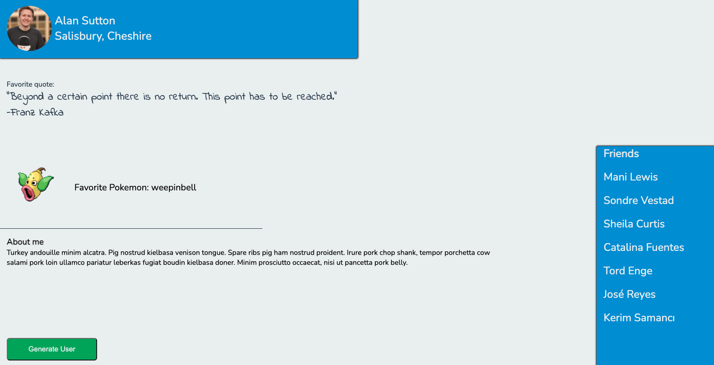

# Random User Page Generator - API Project

Now that you know how to request data from APIs and render data on a page really easily - it's time to put your skills to work!

You'll be making a Random-User-Page-Generator. What exactly is a Random-User-Page-Generator (or RUPG for short, pronounced _ruh-pa-geh_)? It's essentially a Facebook profile page, filled with content taken from APIs and generated with different data at the click of a button.

You'll be using APIs, DOM Manipulation, Promises and of course creating it all in OOP. Are you Excited? Great, because RUPG is a multi-million-dollar-application just waiting for you to create it!

## Instructions

Ultimately, your page will end up looking more or less like this (we count on you making it far nicer than this image...):

Plain and simple, but **all** the data comes from APIs - you will be writing virtually no text!

There are four APIs you'll need to use in order to accomplish this project:

-   [Random User Generator API](https://randomuser.me/documentation#format)
    -   This API returns an array of User objects which a bunch of data on each user
    -   You'll need to request 7 random people from this API
    -   The first will be your main user (the top section on the page), the next 6 will go in your "Friends" section
        -   From your main user you'll need a picture, a first name & last name, the city and state.
        -   From your other 6 users, you'll just the need first and last name
        -   Reference the image above to see how you should properly render this data
-   [Random Kanye Quote Generator API](https://kanye.rest/)
    -   This API returns a random quote from Kanye West
    -   You'll need the quote (the author is always Kanye)
-   [PokeAPI](https://pokeapi.co/docs/v2)
    -   This API is for querying all things pokemon - from cities in the poke-verse, to different berries, and the pokemon themselves
    -   You'll need to query for a random Pokemon from this API.
        -   From the pokemon object you'll need an image of the pokemon, and the name of the pokemon.
    -   _Hint/Fun Fact: there are currently 1025 Pokemon recorded (but we know who the cool ones are...)_
    -   _Another Hint: Sprites are commonly known as images or computer graphics_
-   [Bacon Ipsum API](https://baconipsum.com/json-api/)
    -   This API returns random text, like a [Lorem Ipsum](https://www.lipsum.com/) text generator, but it's text about Meat. Mmm. Tasty.
    -   This is the text you will use for the "About Me" section at the bottom

## Working with New APIs

Part of your work as a developer is to explore and understand new APIs - so if you can't figure out how to get what you want out of an API - **read the documentation**! Remember, when you make a request to an API you're playing by their rules and each API is different!

Strong suggestion: these are all pretty straightforward APIs, so you can test them out using Google (or any browser) - just paste the API link as a URL and you'll be able to see exactly what data returns, which keys it has, etc. Great starting point.

## Extensions

1. Render the pokemon name on your page in "Proper Case" ("Pikachu" instead of "pikachu")
1. Add in two more buttons - a "Save User Page" button and a "Load User Page".
    - Your "Save User Page" button should save a snapshot of your current user to local storage
    - Your "Load User Page" button should load the user that you saved and render the exact user page back on the page - that means the same user, the quote, pokemon, meatText and friends they came with.
1. Save multiple users
    - Edit the object you're saving in Local Storage to be a users object. You'll be adding each user you want to save to this object.
    - Add a drop-down menu with the list of saved users. Now, when you click on the "Load User Page" button, it should load the saved user you select from the drop-down menu

## Evaluation

Following are our evaluation criteria:

- Functionality
- UI/UX Design
- HTML Structure
- CSS Architecture
- MVC Modularity
- Error Handling (handle error gracefully in the UI)
- Clean Code
- Git
- Extensions
