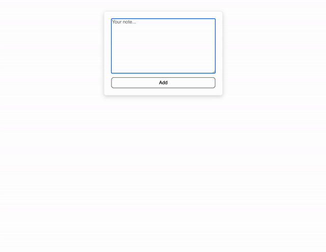
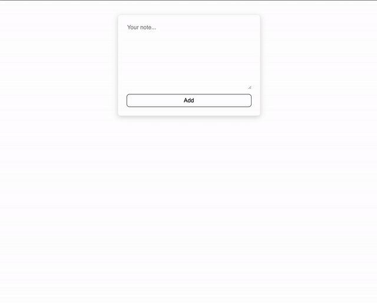
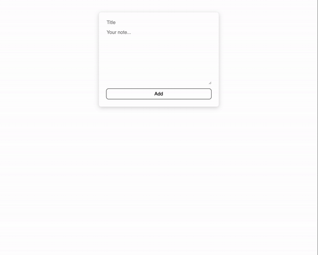
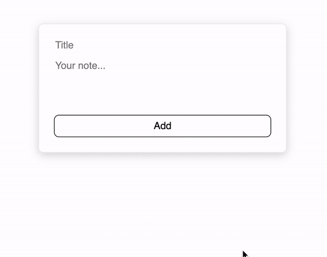
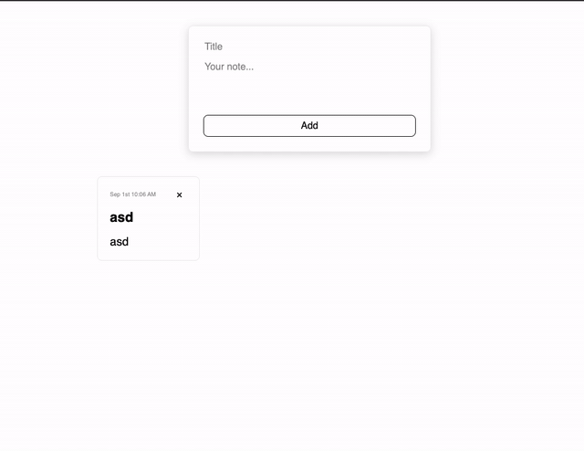
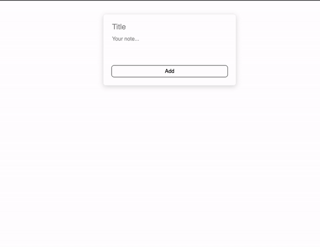

# QuickNotes Project

Welcome to your first React project!

In this project you will need to create a notes app - add notes, change notes, delete notes and more.

**Before you start**

- Read the steps, get a general overview of the project.
- Plan your app, you can even grab a piece of paper to draw your app on, and decide on which components you want to implement, and what they will do.
- Leave extensions for after you finish all steps

## Step 1

- Create a basic form with input (multiline textarea), that allow the user to add notes
- For every note added there should be the text and the date the note was created at
- Display the notes in a grid

## Step 2

- Display date in human readable format: Aug 31th 12:30 PM
  - You can use the JavaScript Date object, or a date library you find online (there are many good ones)
- Add a delete button, that when clicked prompting the user with a message "Are you sure you want to delete your note?" (you can use JavaScript global confirm() function), and if the user hits confirm, delete the note from the list

## Step 3

- Add an optional note title: in the form add an input for note title
- In the note, display the title above the text
- The user can add a note even without a title (then no title will be displayed in the note)

## Step 3.1 - Extension

- Make your textarea to resize dynamically when use types text (add/remove rows)
- Research online on how to do it
- Remove the manual resize handler in the bottom right corner of the textarea
- You can use a library if you find one

## Step 4

- Add a popup modal to show a note
- When a note is clicked, the modal should show the note information
- You can use this library: https://github.com/reactjs/react-modal
- Or you can search for a different one if you like (if you use a UI library, it might have a modal component)

## Step 5

- In the modal, add the ability to edit the note (title and body)
- Use the form component in the modal to edit the note, if needed update your form component to be usable as a new note form and as an update note form
- After the note is edited, add an update date
- Show the update date in the note in addition to the created date

## Step 6

- Make you application live on web via GitHub Pages
- Read the documentation on how to create a production build and how to make available on GitHub Pages

## Step 7

- Save notes to local storage
- The notes should persist between reloads of the page

## Step 8

- Add a category for each note (Personal, Work, etc.)
- Users select a category when creating or updating a note
- Each category has its predefined color. The note background applies this color

## Step 9

- Add search bar that filters the notes based on title or content
- Add filter buttons per category
